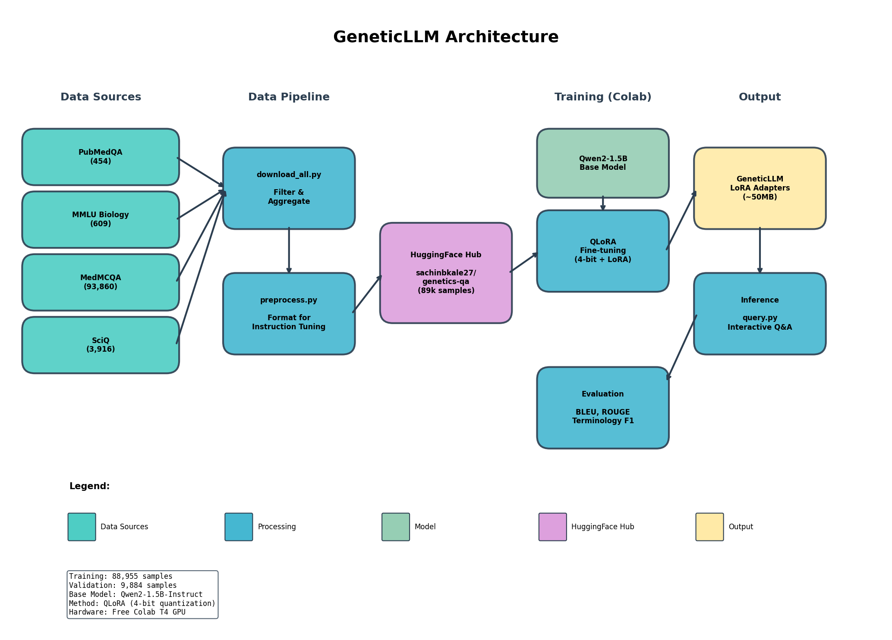

# GeneticLLM

End-to-end LLM fine-tuning for domain-specific Q&A in genetic research.

## Architecture



## What It Does

Fine-tunes a small language model (Qwen2-1.5B) to answer questions about genetics, molecular biology, and genomics — topics like CRISPR, DNA methylation, gene expression, mutations, and inheritance.

## Why It's Portfolio-Worthy

| Skill Demonstrated | Implementation |
|-------------------|----------------|
| **Data Engineering** | Multi-source pipeline aggregating 89k samples from PubMedQA, MMLU, MedMCQA, SciQ |
| **Efficient Training** | QLoRA (4-bit quantization + LoRA) — runs on free Colab T4 GPU |
| **Domain Adaptation** | Filtering and preprocessing for genetics-specific terminology |
| **MLOps** | Dataset hosted on HuggingFace Hub, reproducible training notebook |
| **Evaluation** | BLEU, ROUGE, and domain-specific terminology metrics |

## Project Structure

```
genetic-llm/
├── data/
│   ├── download_all.py      # Fetches from 4 sources
│   ├── preprocess.py        # Formats for instruction tuning
│   └── upload_to_hf.py      # Pushes to HuggingFace Hub
├── training/
│   └── finetune.ipynb       # One-click Colab training
├── evaluation/
│   └── evaluate.py          # Metrics pipeline
├── inference/
│   └── query.py             # Interactive & batch inference
└── README.md
```

## Tech Stack

- **Base Model**: Qwen2-1.5B-Instruct (Apache 2.0)
- **Training**: Unsloth + QLoRA + TRL's SFTTrainer
- **Data**: HuggingFace Datasets
- **Infra**: Google Colab (free tier)

## Links

- **GitHub**: https://github.com/sachinbkale27/genetic-llm
- **Dataset**: https://huggingface.co/datasets/sachinbkale27/genetics-qa
